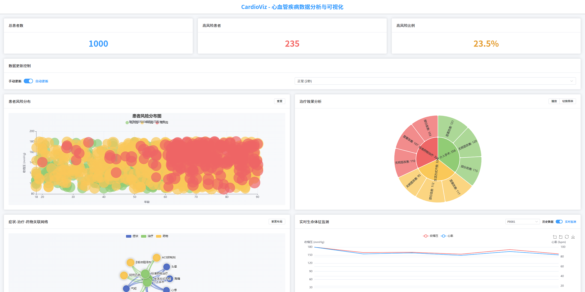

# CardioViz 🫀 - 心血管疾病数据分析与可视化平台

## 项目简介 📋

CardioViz 是一个专注于心血管疾病数据分析和可视化的全栈项目。通过前后端分离架构，结合数据挖掘和交互式可视化技术，为医疗专业人员提供直观的患者风险评估和治疗效果分析工具。

项目截屏：


## 功能特点 ✨

- 🔍 **风险预测分析**
  - 基于多维度健康指标的患者风险评估
  - 直观的风险分布可视化
  - 实时风险等级预警
  - 动态风险评分系统

- 📊 **数据可视化**
  - 交互式散点图展示患者分布
  - 动态时间序列分析
  - 症状-治疗-药物关联网络图
  - 治疗效果评估图表

- 🤖 **智能分析**
  - 多维度特征分析
  - 治疗效果追踪
  - 患者分组管理
  - 实时数据更新

- 📈 **实时监测**
  - 血压和心率时间序列分析
  - 患者状态动态跟踪
  - 治疗响应评估
  - 异常指标预警

## 技术栈 🛠️

### 后端
- **框架**: Flask
- **数据处理**: Python, NumPy, Pandas
- **机器学习**: Scikit-learn, SHAP
- **API**: RESTful API
- **开发工具**: Flask-CORS

### 前端
- **框架**: Vue 3
- **状态管理**: Pinia
- **UI组件**: Element Plus
- **可视化**: ECharts
- **构建工具**: Vite
- **开发语言**: JavaScript/TypeScript

## 可视化组件 🎨

系统实现了多种可视化组件，为医疗决策提供支持：

### 1. 风险分布可视化 (RiskDistributionChart)
多维散点图实现了患者风险分布的直观展示，通过年龄、血压和胆固醇等多维数据映射，使用不同颜色区分风险等级。

### 2. 关联网络可视化 (NetworkAnalysisChart)
症状-治疗-药物关联网络图展示了医疗概念之间的复杂关系，通过力导向图布局和节点分类着色实现直观表达。

### 3. 治疗效果可视化 (TreatmentEffectChart)
旭日图和饼图展示了不同治疗方案的效果分布，支持图表类型切换和动画效果，增强数据理解。

### 4. 实时监测可视化 (VitalsMonitorChart)
生命体征实时监测图表，展示患者血压和心率的动态变化，包括双Y轴设计和异常值预警功能。

### 5. 系统测试图表 (system_test_charts)
基于matplotlib的系统测试图表生成工具，用于性能评估和功能测试结果展示。

## 数据可视化代码文件 📊

项目包含多个用于生成论文中图表的Python脚本文件，使用matplotlib、seaborn、networkx等库实现各类可视化效果：

- **system_test_charts.py** - 系统测试图表生成，包括功能测试覆盖率柱状图和响应时间折线图
- **rf_model_analysis.py** - 随机森林模型分析，展示特征重要性和模型性能评估
- **patient_clustering.py** - 患者分群分析，实现K-means聚类和分群可视化
- **risk_prediction_model.py** - 风险预测模型，包括模型评估指标和ROC曲线
- **risk_factor_weights.py** - 风险因素权重分析，展示各因素对疾病风险的影响程度
- **feature_correlation.py** - 特征相关性分析，包括相关性热力图和特征分布图
- **network_visualization.py** - 复杂网络可视化，展示症状-治疗-药物关联网络
- **simple_network_viz.py** - 简化网络可视化，用于概念展示
- **system_architecture.py** - 系统架构图，展示系统各组件间的关系
- **functional_modules.py** - 功能模块图，展示系统主要功能模块

这些脚本文件生成的图表均用于论文《基于人类心血管疾病的数据挖掘及可视化》的相关章节，提供了数据分析结果的直观展示。

## 项目学术研究 📚

本项目已完成相关学术论文《基于人类心血管疾病的数据挖掘及可视化》，论文详细介绍了系统设计思路、实现技术、数据挖掘方法以及可视化效果评估。主要内容包括：

- 第一章：引言与背景
- 第二章：系统需求分析
- 第三章：数据预处理与特征工程
- 第四章：风险预测模型实现与评估
- 第五章：可视化系统设计与实现
- 第六章：后端系统实现
- 第七章：系统测试结果

论文中的图表生成代码已集成到相应的Python文件中，可用于复现论文中的各种可视化图表。

## 项目结构 📁

```
CardioViz/
├── backend/                # 后端目录
│   ├── app.py             # Flask应用主文件
│   └── requirements.txt   # Python依赖
├── frontend/              # 前端目录
│   ├── src/              # 源代码
│   │   ├── components/   # Vue组件
│   │   ├── stores/       # Pinia状态管理
│   │   ├── views/        # 页面视图
│   │   ├── router/       # 路由配置
│   │   ├── App.vue       # 根组件
│   │   └── main.js       # 入口文件
│   ├── package.json      # 前端依赖
│   └── vite.config.js    # Vite配置
├── img/                   # 图片资源目录
├── 基于人类心血管疾病的数据挖掘及可视化.doc  # 项目论文
├── system_test_charts.py  # 系统测试图表生成
├── rf_model_analysis.py   # 随机森林模型分析
├── patient_clustering.py  # 患者分群分析
├── risk_prediction_model.py # 风险预测模型
├── risk_factor_weights.py # 风险因素权重分析
├── feature_correlation.py # 特征相关性分析
├── network_visualization.py # 网络可视化
├── simple_network_viz.py  # 简化网络可视化
├── system_architecture.py # 系统架构图
├── functional_modules.py  # 功能模块图
├── main.py               # 主程序
└── README.md             # 项目文档
```

## 安装指南 📥

1. 克隆项目
```bash
git clone https://github.com/MilesSG/CardioViz.git
cd CardioViz
```

2. 安装后端依赖
```bash
cd backend
pip install -r requirements.txt
```

3. 安装前端依赖
```bash
cd frontend
npm install
```

4. 启动后端服务
```bash
cd backend
python app.py
```

5. 启动前端服务
```bash
cd frontend
npm run dev
```

6. 访问应用
```
后端API: http://127.0.0.1:5000
前端页面: http://localhost:5173
```

## 数据说明 📊

模拟数据包含以下字段：
- 👤 **患者基本信息**
  - ID、年龄、性别
  - BMI、运动时间、吸烟史
- ❤️ **生理指标**
  - 血压（收缩压/舒张压）
  - 心率
  - 胆固醇
- 🏥 **健康状况**
  - 并发症（糖尿病等）
  - 风险等级评估
  - 运动情况
- 💊 **治疗信息**
  - 症状记录
  - 用药方案
  - 治疗方式
  - 随访记录
- 📈 **监测数据**
  - 实时生命体征
  - 治疗响应评估
  - 风险变化趋势

## 开发计划 🚀

- [ ] 优化数据生成算法
- [ ] 增加更多交互式图表
- [ ] 支持真实医疗数据导入
- [ ] 添加用户认证系统
- [ ] 优化前端性能
- [ ] 增加数据导出功能
- [ ] 完善错误处理机制
- [ ] 添加单元测试

## 贡献指南 🤝

欢迎提交问题和改进建议！请遵循以下步骤：
1. Fork 项目
2. 创建新分支 (`git checkout -b feature/AmazingFeature`)
3. 提交更改 (`git commit -m 'Add some AmazingFeature'`)
4. 推送到分支 (`git push origin feature/AmazingFeature`)
5. 提交 Pull Request

## 许可证 📄

本项目采用 MIT 许可证 - 详见 [LICENSE](LICENSE) 文件

## 联系方式 📧

项目维护者: MilesSG
GitHub: [@MilesSG](https://github.com/MilesSG)
